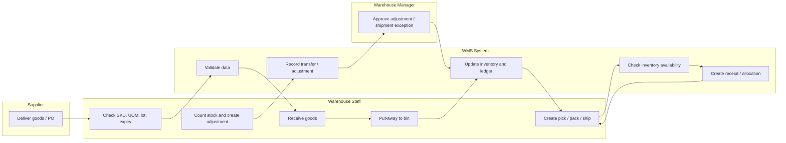

+++
title = "Day 04 - 24/09/2026 (On-site)"
weight = 4
+++

# Daily Report - Day 04

- **Work mode:** On-site
- **Project:** Mini-WMS

## A. Practical work

### 1. Objective

Today I focused on finalizing the project business flow and drawing a swimlane flow so the operational process becomes clearer for both the business and the development team. The goal was to align the understanding of warehouse work from receiving to shipping, transfer, and adjustment.

### 2. What I did today

- Reviewed the project business flow and compared it with the domain logic that had already been defined.
- Confirmed the four main operational flows: Inbound, Outbound, Transfer, and Adjustment.
- Identified the actors in each flow: supplier, warehouse staff, warehouse manager, system, and inventory ledger.
- Drew the swimlane flow to map responsibilities, activities, and decision points clearly.
- Agreed on the key business principle: every stock quantity change must pass through a controlled movement and stock ledger, rather than being changed directly in the inventory table.
- Captured the main validation rules: product duplication checks, UOM conversion, lot and expiry validation, location validity, and approval requirements for adjustment actions.

### 3. Business flow confirmed for the project

#### 3.1 Inbound flow

- Supplier delivers goods according to a PO or receiving document.
- Warehouse staff checks product data, quantity, UOM, lot, and expiry date.
- The system validates the receiving information and creates the receiving record.
- Goods are put away to the correct location or bin.
- The system updates inventory and records the stock ledger movement.
- If an exception occurs, the item is placed on hold or rejected for follow-up.

#### 3.2 Outbound flow

- A sales or warehouse order is created.
- The system checks stock availability and reserves inventory.
- The system allocates stock based on business rules such as FEFO or priority conditions.
- Warehouse staff picks goods from the assigned bin and prepares the shipment.
- Packing and shipping are confirmed.
- Inventory is reduced and the stock ledger is updated.

#### 3.3 Transfer flow

- Goods are moved from one location or zone to another.
- Total stock quantity does not change.
- Only the storage location changes.
- The system records the transfer movement as a valid stock movement.

#### 3.4 Adjustment flow

- Physical stock count is compared with system stock.
- A stock adjustment request is created when a difference is found.
- A warehouse manager reviews and approves or rejects the request.
- After approval, inventory and the stock ledger are updated according to the adjustment.

### 4. Swimlane flow for the project

### 5. Business rules captured today

- Each SKU must have a valid base UOM and a clear conversion rule.
- Barcode and SKU information must be unique and consistent.
- Goods cannot be put away to an invalid or unavailable location.
- Inventory allocation must be performed before outbound shipment.
- Adjustment requests must be reviewed and approved by a manager.
- Every stock change must be traced through the stock ledger.

## B. Summary

### What I learned

- The business flow becomes much clearer when each role and each action are separated in a swimlane diagram.
- A WMS project is not just a CRUD system; it is a process-driven system with strict validation and traceability.
- Frontend and backend must share the same business logic view to avoid mismatches between the interface and warehouse operations.

### Challenges and how I addressed them

- **Business flow was still broad and abstract:** I narrowed the process into four core flows and described each step from start to finish.
- **Different teams might interpret tasks differently:** The swimlane diagram made role responsibilities more explicit.
- **Risk of incorrect stock updates:** I kept the rule that all stock changes must go through the stock ledger and review approval.

## C. Conclusion

Today was the day I locked the project’s business flow and translated it into a clear operational picture. The swimlane flow helps the team understand who does what, when the system validates data, and when approval is required. This makes the next design phase more structured, especially for UI development, integration planning, and business validation.
