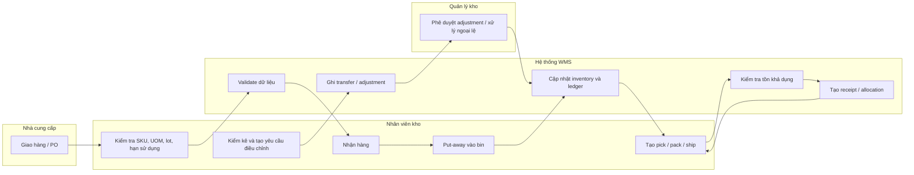

+++
title = "Ngày 04 - 24/09/2026 (On-site)"
weight = 4
+++

# Báo cáo ngày 04

- **Chế độ làm việc:** On-site
- **Dự án:** Mini-WMS

## A. Công việc thực tế

### 1. Mục tiêu

Hôm nay em tập trung chốt lại business flow của dự án và vẽ swimlane flow để mô tả rõ quy trình vận hành từ lúc nhận hàng đến khi xuất kho, chuyển vị trí và điều chỉnh tồn kho. Mục tiêu là thống nhất cách hiểu giữa nghiệp vụ, frontend và backend để mọi bên cùng đi theo một quy trình.

### 2. Những gì em đã làm

- Đọc lại business flow của dự án và đối chiếu với các domain đã xác định trước đó.
- Chốt lại bốn luồng nghiệp vụ chính: Inbound, Outbound, Transfer và Adjustment.
- Xác định vai trò chính trong từng flow: nhà cung cấp, nhân viên kho, quản lý kho, hệ thống và stock ledger.
- Vẽ swimlane flow để minh họa rõ trách nhiệm, hành động và điểm kiểm soát của từng vai trò.
- Đồng bộ nguyên tắc nghiệp vụ quan trọng: mọi thay đổi số lượng tồn kho phải đi qua movement và stock ledger, không được chỉnh trực tiếp bảng inventory.
- Ghi nhận các quy tắc kiểm tra nghiệp vụ quan trọng: SKU, UOM, lot, expiry, vị trí lưu trữ, điều kiện allocation và yêu cầu phê duyệt cho adjustment.

### 3. Business flow đã chốt cho dự án

#### 3.1 Flow nhập kho (Inbound)

- Nhà cung cấp giao hàng theo PO hoặc biên bản nhận hàng.
- Nhân viên kho kiểm tra thông tin SKU, số lượng, UOM, lot và hạn sử dụng.
- Hệ thống validate dữ liệu và tạo bản ghi nhận hàng.
- Hàng hóa được put-away vào vị trí lưu trữ phù hợp.
- Hệ thống cập nhật inventory và ghi stock ledger.
- Nếu xảy ra ngoại lệ, hàng hóa sẽ được giữ hoặc từ chối để xử lý tiếp.

#### 3.2 Flow xuất kho (Outbound)

- Tạo đơn hàng hoặc yêu cầu xuất kho.
- Hệ thống kiểm tra tồn kho khả dụng và thực hiện reservation.
- Hệ thống allocation hàng theo rule nghiệp vụ như FEFO hoặc ưu tiên khác.
- Nhân viên kho pick hàng từ bin đã được gán.
- Đóng gói và xác nhận giao hàng.
- Hệ thống trừ tồn kho và cập nhật stock ledger.

#### 3.3 Flow chuyển vị trí (Transfer)

- Hàng hóa được di chuyển giữa các location hoặc zone khác nhau.
- Tổng số lượng tồn kho không đổi.
- Chỉ thay đổi vị trí lưu trữ của hàng hóa.
- Hệ thống ghi nhận movement transfer để theo dõi lịch sử.

#### 3.4 Flow điều chỉnh tồn kho (Adjustment)

- Thực hiện kiểm kê thực tế và so sánh với dữ liệu hệ thống.
- Tạo yêu cầu điều chỉnh tồn khi phát hiện chênh lệch.
- Quản lý kho xem xét và phê duyệt hoặc từ chối.
- Sau khi được duyệt, inventory và stock ledger được cập nhật theo số liệu điều chỉnh.

### 4. Swimlane flow của dự án

### 5. Các quy tắc nghiệp vụ đã chốt hôm nay

- Mỗi SKU phải có base UOM hợp lệ và quy tắc quy đổi rõ ràng.
- Barcode và thông tin SKU phải nhất quán và không trùng lặp.
- Hàng hóa không được put-away vào location không hợp lệ hoặc không có sẵn.
- Allocation phải được thực hiện trước khi xuất hàng.
- Yêu cầu điều chỉnh tồn kho bắt buộc phải được quản lý kho phê duyệt.
- Mọi thay đổi tồn kho đều phải được truy vết qua stock ledger.

## B. Tổng kết

### Kiến thức đã học

- Business flow trở nên rõ ràng hơn khi được tách thành từng vai trò và từng bước xử lý bằng swimlane diagram.
- Dự án WMS không chỉ là CRUD, mà là hệ thống dựa trên quy trình và ràng buộc nghiệp vụ rất chặt chẽ.
- Frontend và backend cần cùng nhìn một quy trình nghiệp vụ thống nhất để tránh lệch chuẩn giữa UI và hoạt động kho.

### Vấn đề gặp phải và cách xử lý

- **Business flow còn quá rộng và trừu tượng:** em rút gọn thành 4 flow cốt lõi để mô tả đầy đủ từ đầu đến cuối.
- **Khác biệt cách hiểu giữa các vai trò:** swimlane flow giúp làm rõ trách nhiệm của từng bên.
- **Rủi ro sai số trong cập nhật tồn kho:** em giữ nguyên nguyên tắc mọi thay đổi tồn kho phải đi qua stock ledger và phê duyệt.

## C. Kết luận

Hôm nay là ngày em chốt được business flow của dự án và chuyển nó thành một sơ đồ quá trình rõ ràng hơn. Swimlane flow giúp team hiểu được ai làm gì, khi nào hệ thống validate dữ liệu và khi nào cần phê duyệt. Đây là cơ sở quan trọng cho giai đoạn thiết kế tiếp theo, đặc biệt là UI, tích hợp API và kiểm tra nghiệp vụ.
