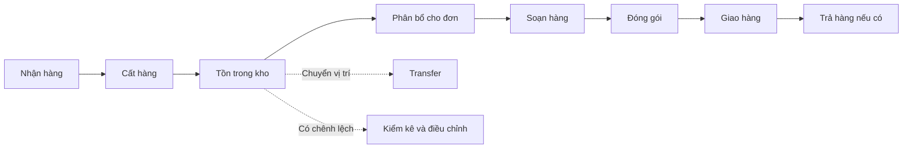

# MINI-WMS — BUSINESS FLOW

> FreshLink Produce — Bản đơn giản hóa cho Sprint 0  
> Mục tiêu: giúp BA, Dev và QA hiểu cùng một luồng nghiệp vụ trước khi thiết kế database/API.

---

## 1. Bức tranh tổng thể

MINI-WMS quản lý hàng từ lúc vào kho đến lúc rời kho:



Bốn Business Flow chính cần nộp trong Sprint 0:

1. Inbound — Nhận hàng và cất hàng.
2. Outbound — Phân bổ, soạn, đóng gói và giao hàng.
3. Transfer — Chuyển hàng giữa các vị trí.
4. Adjustment — Kiểm kê và điều chỉnh tồn.

---

## 2. Ai sử dụng hệ thống?

| Actor | Công việc chính |
|---|---|
| Admin | Quản lý tài khoản, quyền và dữ liệu danh mục. |
| Quản lý kho | Theo dõi kho, tạo đơn, xử lý thiếu hàng và duyệt điều chỉnh. |
| Nhân viên kho | Nhận, cất, chuyển, kiểm kê, soạn và đóng gói hàng. |
| Hệ thống | Kiểm tra dữ liệu, tính tồn, chọn lô FEFO và ghi lịch sử tồn. |

Một người có thể thực hiện nhiều công việc nếu được cấp đúng quyền. Không cần tách Receiver, Picker và Packer thành các loại tài khoản riêng trong MVP.

---

## 3. BF-01 — Inbound: Nhận hàng và cất hàng

### Mục tiêu

Ghi nhận hàng nhà cung cấp giao và đưa hàng vào đúng vị trí lưu trữ.

### Luồng chính

| Bước | Người thực hiện | Kết quả |
|---:|---|---|
| 1 | Nhân viên kho | Chọn phiếu nhận hàng và kho nhận. |
| 2 | Nhân viên kho | Nhập số lượng thực tế, UOM, lot và hạn dùng. |
| 3 | Hệ thống | Kiểm tra dữ liệu và quy đổi sang base UOM. |
| 4 | Hệ thống | Tăng tồn tại khu RECEIVING và ghi lịch sử nhận hàng. |
| 5 | Nhân viên kho | Chọn BIN đích và xác nhận putaway. |
| 6 | Hệ thống | Chuyển tồn từ RECEIVING sang BIN; tổng tồn kho không đổi. |

### Trường hợp cần lưu ý

- Thiếu UOM conversion hoặc thiếu lot/hạn dùng: chưa cho xác nhận nhận hàng.
- Putaway một phần: phần còn lại vẫn nằm ở RECEIVING.
- Hàng tại RECEIVING chưa được dùng để phân bổ cho đơn xuất.

PlantUML: [`business-flow/01-inbound.puml`](business-flow/01-inbound.puml)

---

## 4. BF-02 — Outbound: Từ đơn hàng đến giao hàng

### Mục tiêu

Giữ đúng hàng cho đơn, ưu tiên lô gần hết hạn, soạn và giao theo số lượng thực tế.

### Luồng chính

| Bước | Người thực hiện | Kết quả |
|---:|---|---|
| 1 | Quản lý kho | Tạo đơn gồm SKU, số lượng và UOM. |
| 2 | Hệ thống | Tìm tồn khả dụng và giữ chỗ theo FEFO. |
| 3 | Quản lý kho | Nếu thiếu hàng, chọn cách xử lý phù hợp. |
| 4 | Nhân viên kho | Soạn đúng BIN, SKU và lot đã được phân bổ. |
| 5 | Hệ thống | Chuyển hàng đã soạn từ BIN sang STAGING. |
| 6 | Nhân viên kho | Đóng gói và ghi số cân thực tế nếu là catch weight. |
| 7 | Nhân viên kho | Xác nhận giao; hệ thống trừ hàng khỏi STAGING. |

### Ba cách xử lý thiếu hàng

| Cách xử lý | Ý nghĩa |
|---|---|
| Short ship | Giao số lượng hiện có và ghi nhận phần giao thiếu. |
| Substitution | Dùng SKU thay thế được Quản lý kho chấp nhận. |
| Backorder | Giữ lại phần thiếu để phân bổ và giao sau. |

### Trường hợp cần lưu ý

- Allocation chỉ giữ chỗ; chưa làm giảm tồn vật lý.
- Không được giữ chỗ hoặc soạn vượt tồn khả dụng.
- FEFO chọn lô có hạn dùng gần nhất trước, không phải lô nhập trước.
- Catch weight dùng số cân thực tế cho tồn kho và giao hàng.
- Picking chuyển hàng sang STAGING; Shipping mới làm hàng rời warehouse.

PlantUML: [`business-flow/02-outbound.puml`](business-flow/02-outbound.puml)

---

## 5. BF-03 — Transfer: Chuyển hàng giữa các vị trí

### Mục tiêu

Chuyển hàng từ location nguồn sang location đích trong cùng warehouse.

### Luồng chính

| Bước | Người thực hiện | Kết quả |
|---:|---|---|
| 1 | Nhân viên kho | Chọn source, destination, SKU, lot và quantity. |
| 2 | Hệ thống | Kiểm tra hai location hợp lệ và cùng warehouse. |
| 3 | Hệ thống | Kiểm tra source có đủ tồn chưa được giữ chỗ. |
| 4 | Nhân viên kho | Xác nhận transfer. |
| 5 | Hệ thống | Trừ source, cộng destination và ghi lịch sử chuyển. |

### Trường hợp cần lưu ý

- Tổng tồn của warehouse không thay đổi.
- Không được chuyển phần tồn đang giữ cho đơn xuất.
- Hàng chuyển vào QC hoặc DAMAGED vẫn là tồn vật lý nhưng không được bán.
- Transfer liên warehouse chưa thuộc MVP; cần flow `IN_TRANSIT` riêng.

PlantUML: [`business-flow/03-transfer.puml`](business-flow/03-transfer.puml)

---

## 6. BF-04 — Kiểm kê và điều chỉnh tồn

### Mục tiêu

Đưa số tồn hệ thống về đúng số lượng thực tế nhưng phải có người khác phê duyệt.

### Luồng chính

| Bước | Người thực hiện | Kết quả |
|---:|---|---|
| 1 | Nhân viên kho | Đếm và nhập số lượng thực tế. |
| 2 | Hệ thống | Tính chênh lệch giữa thực tế và hệ thống. |
| 3 | Nhân viên kho | Nếu có chênh lệch, nhập lý do và gửi yêu cầu. |
| 4 | Quản lý kho | Kiểm tra và duyệt hoặc từ chối. |
| 5 | Hệ thống | Chỉ khi được duyệt mới cập nhật tồn và ghi ledger. |

### Trường hợp cần lưu ý

- Người tạo yêu cầu không được tự duyệt.
- Nếu tồn thay đổi trong lúc đang kiểm kê, cần kiểm lại trước khi điều chỉnh.
- Nếu điều chỉnh làm `reserved > on_hand`, phải xử lý allocation liên quan trước.
- Ghi sai sau khi đã áp dụng: tạo bút toán đảo, không sửa ledger cũ.

PlantUML: [`business-flow/04-adjustment.puml`](business-flow/04-adjustment.puml)

---

## 7. Supporting flow

### 7.1 Opening Stock

```text
Tạo đợt import với mã duy nhất
        ↓
Kiểm tra dữ liệu và kiểm tra đã import chưa
        ↓
Nếu chưa import: cộng tồn + ghi ledger
Nếu đã import: bỏ qua, không cộng lần hai
```

PlantUML: [`business-flow/05-opening-stock.puml`](business-flow/05-opening-stock.puml)

### 7.2 Return

```text
Nhận hàng trả
      ↓
Kiểm tra tình trạng
      ↓
┌─────────────┬───────────┬────────────┐
Được bán lại   Chờ QC      Hư hỏng
↓              ↓           ↓
Đưa vào BIN    Đưa vào QC   Đưa vào DAMAGED
```

Hàng trả chỉ được tính là tồn có thể bán sau khi đã được kiểm tra và chuyển vào BIN hợp lệ.

---

## 8. Các quy tắc quan trọng nhất

1. Mọi thay đổi tồn phải đi qua `InventoryLedgerService`.
2. `stock_ledger` chỉ được thêm mới; không sửa hoặc xóa.
3. Tất cả quantity trong inventory và ledger được lưu theo base UOM.
4. `available = on_hand - reserved`.
5. Không cho phép on-hand hoặc available âm.
6. Allocation dùng FEFO và chỉ lấy tồn tại location được phép bán.
7. Adjustment phải có người khác phê duyệt.
8. Opening Stock phải chống import trùng.
9. Các thao tác đồng thời không được làm phát sinh double allocation hoặc sai tồn.

---

## 9. Tác động lên tồn kho

| Nghiệp vụ | On-hand | Reserved | Ghi ledger vật lý? |
|---|---|---|---|
| Receive | Tăng tại RECEIVING | Không đổi | Có |
| Putaway | Chuyển RECEIVING → BIN | Không đổi | Có, một cặp OUT/IN |
| Allocate | Không đổi | Tăng | Không |
| Pick | Chuyển BIN → STAGING | Giảm reservation | Có, một cặp OUT/IN |
| Ship | Giảm tại STAGING | Không đổi | Có |
| Transfer | Chuyển source → destination | Không đổi | Có, một cặp OUT/IN |
| Adjustment được duyệt | Tăng hoặc giảm | Không đổi | Có |

---

## 10. Kịch bản dùng để kiểm tra thiết kế

1. Nhập `10 BOX`, với `1 BOX = 12 EA` → tồn tăng `120 EA`.
2. Putaway `120 EA` từ RECEIVING sang BIN → tổng tồn warehouse không đổi.
3. Đơn `30 EA` → reserved tăng 30, ledger vật lý không đổi.
4. Hai người cùng giữ chỗ lượng tồn cuối → chỉ một giao dịch được thành công.
5. Ba lot khác hạn dùng → lot hết hạn gần nhất được chọn trước.
6. Pick `30 EA` → BIN giảm 30, STAGING tăng 30.
7. Ship `30 EA` → STAGING và tổng tồn warehouse giảm 30.
8. Kiểm kê thiếu `2 EA` → chỉ sau khi duyệt mới ghi `ADJUST_OUT -2`.
9. Người tạo adjustment tự duyệt → hệ thống từ chối.
10. Import Opening Stock cùng mã hai lần → lần hai không cộng tồn.

---

## 11. Những điểm BA/PO còn cần chốt

1. Quy tắc chọn SKU thay thế.
2. Cách theo dõi backorder và trạng thái order sau short ship.
3. Mức sai lệch catch weight được chấp nhận.
4. Adjustment có cần duyệt hai cấp khi số lượng lớn không.
5. Điều kiện để hàng trả được bán lại.
6. Có đưa transfer liên warehouse vào MVP không.
